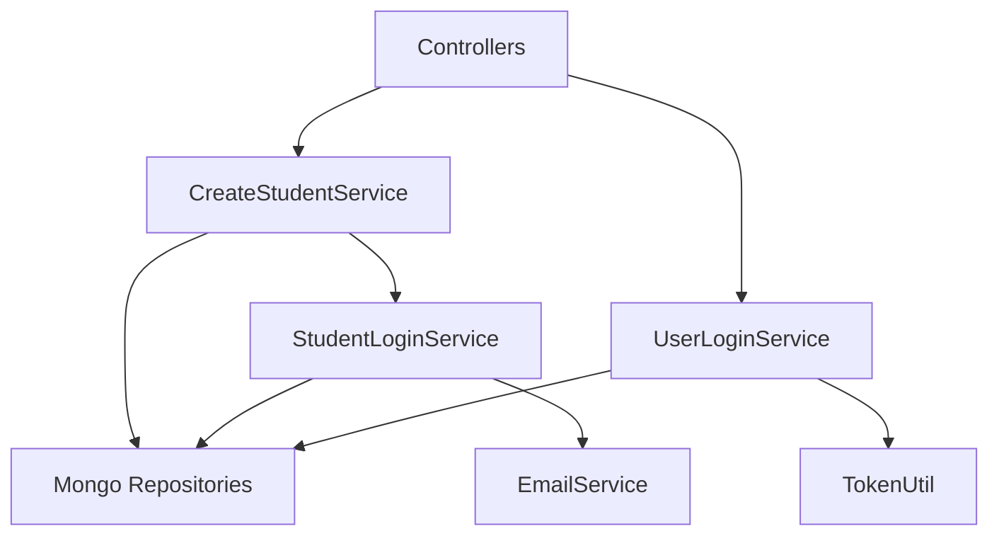

```mermaid
graph TD
Controller[Controllers]
StudentService[CreateStudentService]
LoginService[UserLoginService]
StudentLoginService[StudentLoginService]
EmailService[EmailService]
TokenUtil[TokenUtil]
Repositories[Mongo Repositories]

    Controller --> StudentService
    Controller --> LoginService

    StudentService --> Repositories
    StudentService --> StudentLoginService

    StudentLoginService --> Repositories
    StudentLoginService --> EmailService

    LoginService --> Repositories
    LoginService --> TokenUtil
```