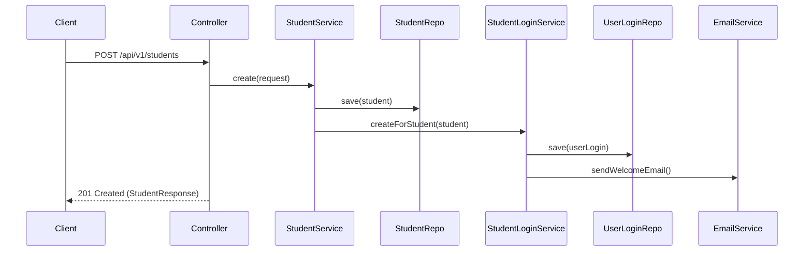

```mermaid

sequenceDiagram
participant Client
participant Controller
participant StudentService
participant StudentRepo
participant StudentLoginService
participant UserLoginRepo
participant EmailService

    Client->>Controller: POST /api/v1/students
    Controller->>StudentService: create(request)
    StudentService->>StudentRepo: save(student)
    StudentService->>StudentLoginService: createForStudent(student)
    StudentLoginService->>UserLoginRepo: save(userLogin)
    StudentLoginService->>EmailService: sendWelcomeEmail()
    Controller-->>Client: 201 Created (StudentResponse)
```