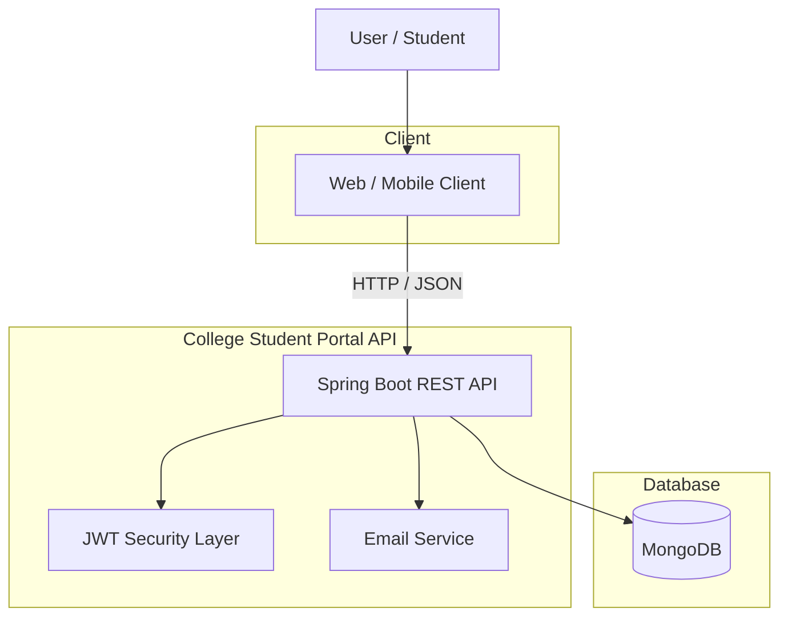

```mermaid
graph TB
User[User / Student]

    subgraph Client
        Browser[Web / Mobile Client]
    end

    subgraph Backend["College Student Portal API"]
        API[Spring Boot REST API]
        Security[JWT Security Layer]
        Mail[Email Service]
    end

    subgraph Database
        Mongo[(MongoDB)]
    end

    User --> Browser
    Browser -->|HTTP / JSON| API
    API --> Security
    API --> Mongo
    API --> Mail
```